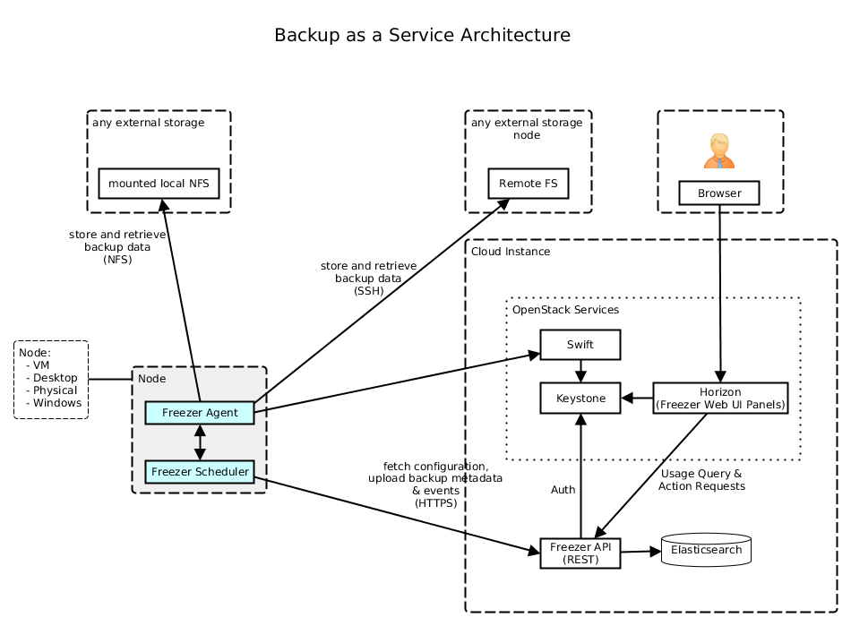
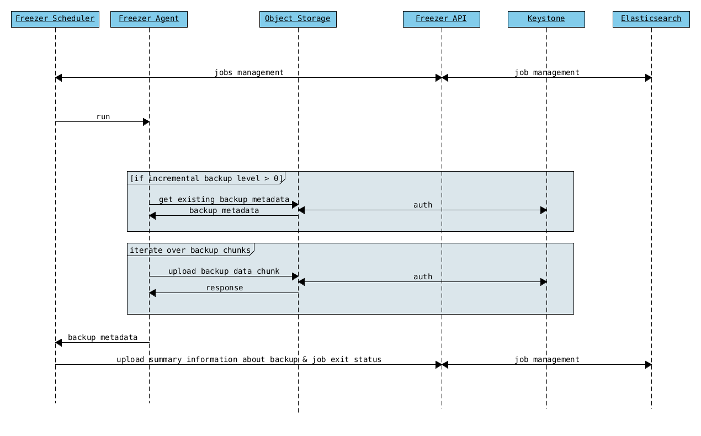
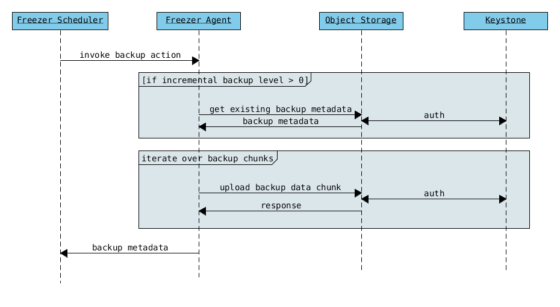
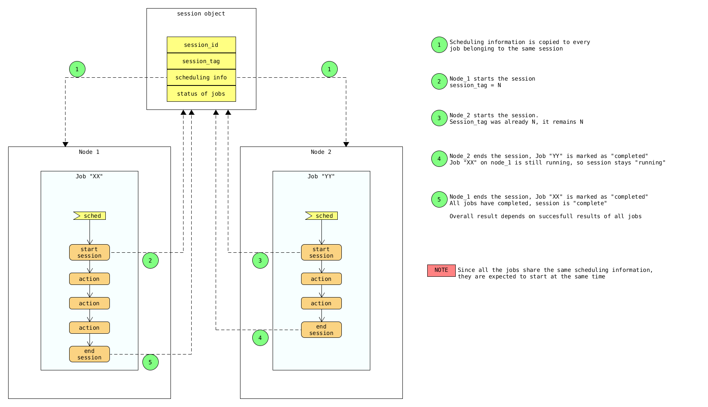

=======
Freezer
=======

Freezer is a Backup Restore DR as a Service platform that helps you to automate the data backup and
restore process.

The following features are available:

-  Backup your filesystem using point in time snapshot
-  Strong encryption supported: AES-256-CFB
-  Backup your file system tree directly (without volume snapshot)
-  Backup your journaled MongoDB directory tree using lvm snap to swift
-  Backup MySQL DB with lvm snapshot
-  Restore your data from a specific date automatically to your file system
-  Low storage consumption as the backup are uploaded as a stream
-  Flexible backup policy (incremental and differential)
-  Data is archived in GNU Tar format for file based incremental
-  Multiple compression algorithm support (zlib, bzip2, xz)
-  Remove old backup automatically according the provided parameters
-  Multiple storage media support (Swift, local file system, ssh)
-  Flush kernel buffered memory to disk
-  Multi platform (Linux, Windows, \*BSD, OSX)
-  Manage multiple jobs (i.e. multiple backups on the same node)
-  Synchronize backups and restore on multiple nodes
-  Web user interface integrated with OpenStack Horizon
-  Can execute scripts/commands before or after a job execution

Requirements
============

-  OpenStack Swift Account (optional)
-  python
-  GNU Tar >= 1.26
-  gzip, bzip2, xz
-  OpenSSL
-  python-swiftclient
-  python-keystoneclient
-  pymongo
-  PyMySQL
-  libmysqlclient-dev
-  sync
-  At least 128 MB of memory reserved for Freezer

Windows Requirements
====================

- Cygwin

The following components support Windowd OS Platform:

- freezer-agent
- freezer-scheduler

However Cygwin is required to execute backup and restore. The following
binaries and dll needs to be installed:

-  bunzip2.exe
-  bzcat.exe
-  bzip2.exe
-  bzip2recover.exe
-  cygbz2-1.dll
-  cygiconv-2.dll
-  cygintl-8.dll
-  cygwin1.dll
-  find.exe
-  gzip.exe
-  tar.exe

The .dll needs to on the Windows System Path.

Installation & Env Setup
========================

Install required packages
-------------------------

Ubuntu / Debian
---------------

Swift client and Keystone client::

    $ sudo apt-get install -y python-dev
    $ sudo easy_install -U pip

MongoDB backup::

    $ sudo apt-get install -y python-pymongo

MySQL backup::

    $ sudo pip install pymysql

Freezer installation from Python package repo::

    $ sudo pip install freezer

OR::

    $ sudo easy_install freezer

The basic Swift account configuration is needed to use freezer. Make
sure python-swiftclient is installed.

Also the following ENV var are needed you can put them in ~/.bashrc::

    export OS_REGION_NAME=region-a.geo-1
    export OS_TENANT_ID=<account tenant>
    export OS_PASSWORD=<account password>
    export OS_AUTH_URL=https://region-a.geo-1.identity.hpcloudsvc.com:35357/v2.0
    export OS_USERNAME=automationbackup
    export OS_TENANT_NAME=automationbackup

    $ source ~/.bashrc

Let's say you have a container called freezer_foobar-container, by executing
"swift list" you should see something like::

    $ swift list
    freezer_foobar-container-2
    $

These are just use case example using Swift in the HP Cloud.

*Is strongly advised to use execute a backup using LVM snapshot, so
freezer will execute a backup on point-in-time data. This avoid risks of
data inconsistencies and corruption.*

Windows
-------

Install OpenSSL binaries from http://www.openssl.org/related/binaries.html and add
it to Path:

Install sync binaries from https://technet.microsoft.com/en-us/sysinternals/bb897438 and add
it to Path

General packages::

    > easy_install -U pip
    > pip install freezer

The basic Swift account configuration is needed to use freezer. Make sure python-swiftclient is installed::

    set OS_REGION_NAME=region-a.geo-1
    set OS_TENANT_ID=<account tenant>
    set OS_PASSWORD=<account password>
    set OS_AUTH_URL=https://region-a.geo-1.identity.hpcloudsvc.com:35357/v2.0
    set OS_USERNAME=automationbackup
    set OS_TENANT_NAME=automationbackup

Usage Example
=============

Freezer will automatically add the prefix "freezer_" to the container name,
where it is provided by the user and doesn't already start with this prefix.
If no container name is provided, the default is freezer_backups.

The execution arguments can be set from command line and/or config file
in ini format. there's an example of the job config file available in
freezer/freezer/specs/job-backup.conf.example. Command line options
always override the same options in the config file.

Backup
------

The most simple backup execution is a direct file system backup::

    $ sudo freezerc --file-to-backup /data/dir/to/backup
    --container freezer_new-data-backup --backup-name my-backup-name

    * On windows (need admin rights)*
    > freezerc --action backup --mode fs --backup-name testwindows
    --path-to-backup "C:\path\to\backup" --container freezer_windows
    --log-file  C:\path\to\log\freezer.log

By default --mode fs is set. The command would generate a compressed tar
gzip file of the directory /data/dir/to/backup. The generated file will
be segmented in stream and uploaded in the swift container called
freezer_new-data-backup, with backup name my-backup-name

Now check if your backup is executing correctly looking at
/var/log/freezer.log

Execute a MongoDB backup using lvm snapshot:

We need to check before on which volume group and logical volume our
mongo data is. These information can be obtained as per following::

    $ mount
    [...]

Once we know the volume where our Mongo data is mounted on, we can get
the volume group and logical volume info::

    $ sudo vgdisplay
    [...]
    $ sudo lvdisplay
    [...]

We assume our mongo volume is "/dev/mongo/mongolv" and the volume group
is "mongo"::

    $ sudo freezerc --lvm-srcvol /dev/mongo/mongolv --lvm-dirmount /var/lib/snapshot-backup
    --lvm-volgroup mongo --file-to-backup /var/lib/snapshot-backup/mongod_ops2
    --container freezer_mongodb-backup-prod --exclude "*.lock" --mode mongo --backup-name mongod-ops2

Now freezerc create a lvm snapshot of the volume /dev/mongo/mongolv. If
no options are provided, default snapshot name is freezer\_backup\_snap.
The snap vol will be mounted automatically on /var/lib/snapshot-backup
and the backup meta and segments will be upload in the container
mongodb-backup-prod with the name mongod-ops2.

Execute a file system backup using lvm snapshot::

    $ sudo freezerc --lvm-srcvol /dev/jenkins/jenkins-home --lvm-dirmount
    /var/snapshot-backup --lvm-volgroup jenkins
    --file-to-backup /var/snapshot-backup --container freezer_jenkins-backup-prod
    --exclude "\*.lock" --mode fs --backup-name jenkins-ops2

MySQL backup require a basic configuration file. The following is an
example of the config::

    $ sudo cat /root/.freezer/db.conf
    host = your.mysql.host.ip
    user = backup
    password = userpassword

Every listed option is mandatory. There's no need to stop the mysql
service before the backup execution.

Execute a MySQL backup using lvm snapshot::

    $ sudo freezerc --lvm-srcvol /dev/mysqlvg/mysqlvol
    --lvm-dirmount /var/snapshot-backup
    --lvm-volgroup mysqlvg --file-to-backup /var/snapshot-backup
    --mysql-conf /root/.freezer/freezer-mysql.conf--container
    freezer_mysql-backup-prod --mode mysql --backup-name mysql-ops002

Cinder backups

To make a cinder backup you should provide cinder-vol-id or cindernative-vol-id
parameter in command line arguments. Freezer doesn't do any additional checks
and assumes that making backup of that image will be sufficient to restore your
data in future.

Execute a cinder backup::
    $ freezerc --cinder-vol-id 3ad7a62f-217a-48cd-a861-43ec0a04a78b

Execute a mysql backup with cinder::

   $ freezerc --mysql-conf /root/.freezer/freezer-mysql.conf
   --container freezer_mysql-backup-prod --mode mysql
   --backup-name mysql-ops002
   --cinder-vol-id 3ad7a62f-217a-48cd-a861-43ec0a04a78b

Nova backups

To make a nova backup you should provide nova parameter in arguments.
Freezer doesn't do any additional checks and assumes that making backup
of that instance will be sufficient to restore your data in future.

Execute a nova backup::
    $ freezerc --nova-inst-id 3ad7a62f-217a-48cd-a861-43ec0a04a78b

Execute a mysql backup with nova::

   $ freezerc --mysql-conf /root/.freezer/freezer-mysql.conf
   --container freezer_mysql-backup-prod --mode mysql
   --backup-name mysql-ops002
   --nova-inst-id 3ad7a62f-217a-48cd-a861-43ec0a04a78b

All the freezerc activities are logged into /var/log/freezer.log.

Swift, Local and SSH Storages
-----------------------------

Freezer can use:

 local storage - folder that is available in the same os (may be mounted)

 To use local storage specify "--storage local"
 And use "--container %path-to-folder-with-backups%"
 Backup example::

   $ sudo freezerc --file-to-backup /data/dir/to/backup
   --container /tmp/my_backup_path/ --backup-name my-backup-name
   --storage local

 Restore example::

   $ sudo freezerc --action restore --restore-abs-path /data/dir/to/backup
   --container /tmp/my_backup_path/ --backup-name my-backup-name
   --storage local

 swift storage - OS object storage

 To use local storage specify "--storage swift" or skip "--storage" parameter at all.
 And use "--container %swift-container-name%"

 Backup example::

   $ sudo freezerc --file-to-backup /data/dir/to/backup
   --container freezer-container --backup-name my-backup-name
   --storage swift

 Restore example::

   $ sudo freezerc --action restore --restore-abs-path /data/dir/to/backup
   --container freezer-container --backup-name my-backup-name
   --storage swift

 ssh storage - folder on remote machine

 To use ssh storage specify "--storage ssh"
 And use "--container %path-to-folder-with-backups-on-remote-machine%"
 Also you should specify ssh-username, ssh-key and ssh-host parameters.
 ssh-port is optional parameter, default is 22

 ssh-username for user ubuntu should be "--ssh-username ubuntu"
 ssh-key should be path to your secret ssh key "--ssh-key %path-to-secret-key%"
 ssh-host can be ip of remote machine or resolvable dns name "--ssh-host 8.8.8.8"

 Backup example::

   $ sudo freezerc --file-to-backup /data/dir/to/backup
   --container /remote-machine-path/ --backup-name my-backup-name
   --storage ssh --ssh-username ubuntu --ssh-key ~/.ssh/id_rsa
   --ssh-host 8.8.8.8

 Restore example::

  $ sudo freezerc  --action restore --restore-abs-pat /data/dir/to/backup
  --container /remote-machine-path/ --backup-name my-backup-name
  --storage ssh --ssh-username ubuntu --ssh-key ~/.ssh/id_rsa
  --ssh-host 8.8.8.8

Restore
-------

As a general rule, when you execute a restore, the application that
write or read data should be stopped.

There are 3 main options that need to be set for data restore

File System Restore:

Execute a file system restore of the backup name
adminui.git::

    $ sudo freezerc --action restore --container freezer_foobar-container-2
    --backup-name adminui.git
    --hostname git-HP-DL380-host-001 --restore-abs-path
    /home/git/repositories/adminui.git/
    --restore-from-date "2014-05-23T23:23:23"

MySQL restore:

Execute a MySQL restore of the backup name holly-mysql.
Let's stop mysql service first::

    $ sudo service mysql stop

Execute Restore::

    $ sudo freezerc --action restore --container freezer_foobar-container-2
    --backup-name mysq-prod --hostname db-HP-DL380-host-001
    --restore-abs-path /var/lib/mysql --restore-from-date "2014-05-23T23:23:23"

And finally restart mysql::

    $ sudo service mysql start

Execute a MongoDB restore of the backup name mongobigdata::

    $ sudo freezerc --action restore --container freezer_foobar-container-2
    --backup-name mongobigdata --hostname db-HP-DL380-host-001
    --restore-abs-path /var/lib/mongo --restore-from-date "2014-05-23T23:23:23"

List remote containers::

    $ sudo freezerc --action info  -L

List remote objects in container::

    $ sudo freezerc --action info --container freezer_testcontainer -l

Remove backups older then 1 day::

    $ freezerc --action admin --container freezer_dev-test --remove-older-then 1 --backup-name dev-test-01

Cinder restore currently creates a volume with content of saved one, but
doesn't implement deattach of existing volume and attach the new one to the
vm. You should implement this steps manually. To create new volume from
existing content run next command:

Execute a cinder restore::

    $ freezerc --action restore --cinder-inst-id 3ad7a62f-217a-48cd-a861-43ec0a04a78b
    $ freezerc --action restore --cindernative-vol-id 3ad7a62f-217a-48cd-a861-43ec0a04a78b

Nova restore currently creates an instance with content of saved one, but the
ip address of vm will be different as well as it's id.

Execute a nova restore::

    $ freezerc --action restore --nova-inst-id 3ad7a62f-217a-48cd-a861-43ec0a04a78b

Local storage restore execution:

    $ sudo freezerc --action restore --container /local_backup_storage/
    --backup-name adminui.git
    --hostname git-HP-DL380-host-001 --restore-abs-path
    /home/git/repositories/adminui.git/
    --restore-from-date "2014-05-23T23:23:23"
    --storage local

Architecture
============

Freezer architectural components are the following:

-  OpenStack Swift (the storage)
-  freezer client running on the node you want to execute the backups or
   restore

Freezer use GNU Tar under the hood to execute incremental backup and
restore. When a key is provided, it uses OpenSSL to encrypt data
(AES-256-CFB)
=============
Freezer architecture is composed by the following components:

+-------------------+------------------------------------------------------------------------------------------------------------------------------------------------+
| Component         | Description                                                                                                                                    |
+===================+================================================================================================================================================+
| Freezer Web UI    | Web interface that interact with the Freezer API to configure, change settings.                                                                |
|                   | It provides most of the feature from the freezerc CLI, advanced scheduler settings as multi-node backup synchronization, metrics and reporting.|
+-------------------+------------------------------------------------------------------------------------------------------------------------------------------------+
| Freezer Scheduler | A client side component, running on the node where the data backup has to be executed.                                                         |
|                   | It consist of a daemon that retrieve the data from the freezer API and execute jobs (i.e. backups, restore, admin actions, info actions,       |
|                   | pre and/or post job scripts) by running the Freezer Agent.                                                                                     |
|                   | The metrics and exit codes returned by the freezer agent are captured and sent to the Freezer API.                                             |
|                   | The scheduler manage the execution and synchronization of multiple jobs executed on a single or multiple nodes.                                |
|                   | The status of the execution of all the nodes is saved through the API.                                                                         |
|                   | The Freezer scheduler take care of uploading jobs to the API by reading job files on the file system.                                          |
|                   | It also have its own configuration file where job session or other settings like the freezer API polling interval can be configured.           |
|                   | The Freezer scheduler manage jobs, for more information about jobs please refer to: freezer_api/README.rst under JOB the sections              |
+-------------------+------------------------------------------------------------------------------------------------------------------------------------------------+
| Freezer Agent     | Multiprocessing Python software that runs at client side, where the data backup has to be executed.                                            |
|                   | It can be executed standalone or by the Freezer Scheduler.                                                                                     |
|                   | The freezerc provide flexible way to execute backup, restore and other actions on a running system.                                            |
|                   | In order to provide flexibility in terms of data integrity, speed, performance, resources usage etc the freezer agent offer a                  |
|                   | wide range of options to execute optimized backup according the available resources as:                                                        |
|                   |                                                                                                                                                |
|                   |   - Segments size (the amount of memory used)                                                                                                  |
|                   |   - Queues size (optimize backups where I/O, bandwidth, memory or CPU is a constraints)                                                        |
|                   |   - I/O Affinity and process priority (it can be used with real time I/O and maximum user level process priority)                              |
|                   |   - Bandwidth limitation                                                                                                                       |
|                   |   - Client side Encryption (AES-256-CFB)                                                                                                       |
|                   |   - Compression (multiple algorithms supported as zlib, bzip2, xz/lzma)                                                                        |
|                   |   - Parallel upload to pluggable storage media (i.e. upload backup to swift and to a remote node by ssh,                                       |
|                   |     or upload to two or more independent swift instances with different credentials, etc)                                                      |
|                   |   - Execute file based incremental (like tar), block based incremental (like rsync algorithm) and differential based backup and restore        |
|                   |   - Multiplatform as it can be run on Linux, Windows, \*BSD and OSX                                                                            |
|                   |   - Automatic removal of old backups                                                                                                           |
+-------------------+------------------------------------------------------------------------------------------------------------------------------------------------+
| Freezer API       | API are used to store and provide metadata to the Freezer Web UI and to the Freezer Scheduler.                                                 |
|                   | Also the API are used to store session information for multi node backup synchronization. No workload data is stored in the API.               |
|                   | For more information to the API please refer to: freezer_api/README.rst                                                                        |
+-------------------+------------------------------------------------------------------------------------------------------------------------------------------------+
| DB Elasticsearch  | Backend used by the API to store and retrieve metrics, metadata sessions information job status, etc.                                          |
+-------------------+------------------------------------------------------------------------------------------------------------------------------------------------+

Freezer currently use GNU Tar under the hood to execute incremental backup and
restore. When a key is provided, it uses OpenSSL to encrypt data (AES-256-CFB)

The following diagrams can help to better understand the solution:

**Service Architecture**

**Freezer Agent backup work flow with API**

**Freezer Agent backup without API**

**Freezer Scheduler with API**

.. image:: specs/freezer_scheduler_api.png

**Freezer Job Session**

**Freezer Dashboard**

.. image:: specs/freezer_dashboard.png

**How to scale**

.. image:: specs/freezer_scheduler_api.png

Low resources requirement
-------------------------

Freezer is designed to reduce at the minimum I/O, CPU and Memory Usage.
This is achieved by generating a data stream from tar (for archiving)
and gzip (for compressing). Freezer segment the stream in a configurable
chunk size (with the option --max-seg-size). The default segment size is
64MB, so it can be safely stored in memory, encrypted if the key is
provided, and uploaded to Swift as segment.

Multiple segments are sequentially uploaded using the Swift Manifest.
All the segments are uploaded first, and then the Manifest file is
uploaded too, so the data segments cannot be accessed directly. This
ensue data consistency.

By keeping small segments in memory, I/O usage is reduced. Also as
there's no need to store locally the final compressed archive
(tar-gziped), no additional or dedicated storage is required for the
backup execution. The only additional storage needed is the LVM snapshot
size (set by default at 5GB). The lvm snapshot size can be set with the
option --lvm-snapsize. It is important to not specify a too small snap
size, because in case a quantity of data is being wrote to the source
volume and consequently the lvm snapshot is filled up, then the data is
corrupted.

If the more memory is available for the backup process, the maximum
segment size can be increased, this will speed up the process. Please
note, the segments must be smaller then 5GB, is that is the maximum
object size in the Swift server.

Au contraire, if a server have small memory availability, the
--max-seg-size option can be set to lower values. The unit of this
option is in bytes.

How the incremental works
-------------------------

The incremental backups is one of the most crucial feature. The
following basic logic happens when Freezer execute:

1) Freezer start the execution and check if the provided backup name for
   the current node already exist in Swift

2) If the backup exists, the Manifest file is retrieved. This is
   important as the Manifest file contains the information of the
   previous Freezer execution.

Nova and Cinder Backups
-----------------------

If our data is stored on cinder volume or nova instance disk, we can implement
file backup using nova snapshots or volume backups.

Nova backups:

If you provide nova argument in parameters freezer assume that all
necessary data is located on instance disk and it can be successfully stored
using nova snapshot mechanism.

For example if we want to store our mysql located on instance disk, we
will execute the same actions like in case of lvm or tar snapshots, but
we will invoke nova snapshot instead of lvm or tar.

After that we will place snapshot to swift container as dynamic large object.

container/%instance_id%/%timestamp% <- large object with metadata
container_segments/%instance_id%/%timestamp%/segments...

Restore will create a snapshot from stored data and restore an instance from
this snapshot. Instance will have different id and old instance should be
terminated manually.

Cinder backups:

Cinder has it's own mechanism for backups and freezer supports it. But it also
allows create a glance image from volume and upload to swift.

To use standard cinder backups please provide --cindernative-vol-id argument.

freezer-scheduler
-----------------
The freezer-scheduler is one of the two freezer components which is run on
the client nodes, the other one being the freezer-agent.
It has a double role: it is used both to start the scheduler process, and as
a cli-tool which allows the user to interact with the api.

The freezer-scheduler process can be started/stopped in daemon mode using the usual
positional arguments
::

  freezer-scheduler start|stop

It can be also be started as a foreground process using the --no-daemon flag:
::

  freezer-scheduler --no-daemon start

This can be useful for testing purposes or when launched in a Docker container
or by a babysitting process such as systemd.

The cli-tool version is used to manage the jobs in the api.
A "job" is basically a container, a document which contains one
or more "actions".
An action contains the instructions for the freezer-agent. They are the same parameter
that would be passed to the agent on the command line, for example:
"backup_name", "path_to_backup", "max_level"

To sum it up, a job is a sequence of parameters that the scheduler pulls
from the api and passes to a newly spawned freezer-agent process at the
right time.

The scheduler understands the "scheduling" part of the job document,
which it uses to actually schedule the job, while the rest of the parameters
are substantially opaque.

It may also be useful to use the "-c" parameter to specify the client-id that
the scheduler will use when interacting with the api.

The purpose of the *client-id* is that of associate a job with the
scheduler instance which is supposed to execute that job.

A single openstack user could manage different resources on different nodes
(and actually may even have different freezer-scheduler instances running
on the same node with different local privileges, for example),
and the client-id allows him to associate the specific scheduler instance
with its specific jobs.

When not provided with a custom client-id, the scheduler falls to the default
which is composed from the tenant-is and the hostname of the machine it is
running on.

The first step to use the scheduler is creating a document with the job:
::

  cat test_job.json

  {
    "job_actions": [
        {
            "freezer_action": {
                "action": "backup",
                "mode": "fs",
                "backup_name": "backup1",
                "path_to_backup": "/home/me/datadir",
                "container": "schedule_backups",
                "log_file": "/home/me/.freezer/freezer.log"
            },
            "max_retries": 3,
            "max_retries_interval": 60
        }
    ],
    "job_schedule": {
        "schedule_interval": "4 hours",
        "schedule_start_date": "2015-08-16T17:58:00"
    },
    "description": "my scheduled backup 6"
  }

Then upload that job into the api:
::

  freezer-scheduler -c node12 job-create --file test_job.json

The newly created job can be found with:
::

  freezer-scheduler -c node12 job-list

  +----------------------------------+--------------------+-----------+--------+-------+--------+------------+
  |              job_id              |    description     | # actions | status | event | result | session_id |
  +----------------------------------+--------------------+-----------+--------+-------+--------+------------+
  | 07999ea33a494ccf84590191d6fe850c | schedule_backups 6 |     1     |        |       |        |            |
  +----------------------------------+--------------------+-----------+--------+-------+--------+------------+

Its content can be read with:
::

  freezer-scheduler -c node12 job-get -j 07999ea33a494ccf84590191d6fe850c

The scheduler can be started on the target node with:
::

  freezer-scheduler -c node12 -i 15 -f ~/job_dir start

The scheduler could have already been started. As soon as the freezer-scheduler contacts the api,
it fetches the job and schedules it.

Miscellanea
-----------

Please check the FAQ to: FAQ.rst

Available options::

usage: freezerc [-h] [--config CONFIG]
                [--action {backup,restore,info,admin,exec}]
                [-F PATH_TO_BACKUP] [-N BACKUP_NAME] [-m MODE] [-C CONTAINER]
                [-L] [-l] [-o GET_OBJECT] [-d DST_FILE] [-s]
                [--lvm-auto-snap LVM_AUTO_SNAP] [--lvm-srcvol LVM_SRCVOL]
                [--lvm-snapname LVM_SNAPNAME] [--lvm-snap-perm {ro,rw}]
                [--lvm-snapsize LVM_SNAPSIZE] [--lvm-dirmount LVM_DIRMOUNT]
                [--lvm-volgroup LVM_VOLGROUP] [--max-level MAX_LEVEL]
                [--always-level ALWAYS_LEVEL]
                [--restart-always-level RESTART_ALWAYS_LEVEL]
                [-R REMOVE_OLDER_THAN] [--remove-from-date REMOVE_FROM_DATE]
                [--no-incremental] [--hostname HOSTNAME]
                [--mysql-conf MYSQL_CONF] [--metadata-out METADATA_OUT]
                [--log-file LOG_FILE] [--exclude EXCLUDE]
                [--dereference-symlink {none,soft,hard,all}] [-U]
                [--encrypt-pass-file ENCRYPT_PASS_FILE] [-M MAX_SEGMENT_SIZE]
                [--restore-abs-path RESTORE_ABS_PATH]
                [--restore-from-host HOSTNAME]
                [--restore-from-date RESTORE_FROM_DATE] [--max-priority] [-V]
                [-q] [--insecure] [--os-auth-ver {1,2,2.0,3}] [--proxy PROXY]
                [--dry-run] [--upload-limit UPLOAD_LIMIT]
                [--cinder-vol-id CINDER_VOL_ID] [--nova-inst-id NOVA_INST_ID]
                [--cindernative-vol-id CINDERNATIVE_VOL_ID]
                [--download-limit DOWNLOAD_LIMIT]
                [--sql-server-conf SQL_SERVER_CONF] [--vssadmin VSSADMIN]
                [--command COMMAND] [--compression {gzip,bzip2,xz}]
                [--storage {local,swift,ssh}] [--ssh-key SSH_KEY]
                [--ssh-username SSH_USERNAME] [--ssh-host SSH_HOST]
                [--ssh-port SSH_PORT]

    optional arguments:
      -h, --help            show this help message and exit
      --config CONFIG       Config file abs path. Option arguments are provided
                            from config file. When config file is used any option
                            from command line provided take precedence.
      --action {backup,restore,info,admin,exec}
                            Set the action to be taken. backup and restore are
                            self explanatory, info is used to retrieve info from
                            the storage media, exec is used to execute a script,
                            while admin is used to delete old backups and other
                            admin actions. Default backup.
      -F PATH_TO_BACKUP, --path-to-backup PATH_TO_BACKUP, --file-to-backup PATH_TO_BACKUP
                            The file or directory you want to back up to Swift
      -N BACKUP_NAME, --backup-name BACKUP_NAME
                            The backup name you want to use to identify your
                            backup on Swift
      -m MODE, --mode MODE  Set the technology to back from. Options are, fs
                            (filesystem), mongo (MongoDB), mysql (MySQL),
                            sqlserver (SQL Server) Default set to fs
      -C CONTAINER, --container CONTAINER
                            The Swift container (or path to local storage) used to
                            upload files to
      -L, --list-containers
                            List the Swift containers on remote Object Storage
                            Server
      -l, --list-objects    List the Swift objects stored in a container on remote
                            Object Storage Server.
      -o GET_OBJECT, --get-object GET_OBJECT
                            The Object name you want to download on the local file
                            system.
      -d DST_FILE, --dst-file DST_FILE
                            The file name used to save the object on your local
                            disk and upload file in swift
      -s, --snapshot        Create a snapshot of the fs containing the resource to
                            backup. When used, the lvm parameters will be guessed
                            and/or the default values will be used
      --lvm-auto-snap LVM_AUTO_SNAP
                            Automatically guess the volume group and volume name
                            for given PATH.
      --lvm-srcvol LVM_SRCVOL
                            Set the lvm volume you want to take a snaphost from.
                            Default no volume
      --lvm-snapname LVM_SNAPNAME
                            Set the lvm snapshot name to use. If the snapshot name
                            already exists, the old one will be used a no new one
                            will be created. Default freezer_backup_snap.
      --lvm-snap-perm {ro,rw}
                            Set the lvm snapshot permission to use. If the
                            permission is set to ro The snapshot will be immutable
                            - read only -. If the permission is set to rw it will
                            be mutable
      --lvm-snapsize LVM_SNAPSIZE
                            Set the lvm snapshot size when creating a new
                            snapshot. Please add G for Gigabytes or M for
                            Megabytes, i.e. 500M or 8G. Default 1G.
      --lvm-dirmount LVM_DIRMOUNT
                            Set the directory you want to mount the lvm snapshot
                            to. Default to /var/lib/freezer
      --lvm-volgroup LVM_VOLGROUP
                            Specify the volume group of your logical volume. This
                            is important to mount your snapshot volume. Default
                            not set
      --max-level MAX_LEVEL
                            Set the backup level used with tar to implement
                            incremental backup. If a level 1 is specified but no
                            level 0 is already available, a level 0 will be done
                            and subsequently backs to level 1. Default 0 (No
                            Incremental)
      --always-level ALWAYS_LEVEL
                            Set backup maximum level used with tar to implement
                            incremental backup. If a level 3 is specified, the
                            backup will be executed from level 0 to level 3 and to
                            that point always a backup level 3 will be executed.
                            It will not restart from level 0. This option has
                            precedence over --max-backup-level. Default False
                            (Disabled)
      --restart-always-level RESTART_ALWAYS_LEVEL
                            Restart the backup from level 0 after n days. Valid
                            only if --always-level option if set. If --always-
                            level is used together with --remove-older-then, there
                            might be the chance where the initial level 0 will be
                            removed Default False (Disabled)
      -R REMOVE_OLDER_THAN, --remove-older-then REMOVE_OLDER_THAN, --remove-older-than REMOVE_OLDER_THAN
                            Checks in the specified container for object older
                            than the specified days.If i.e. 30 is specified, it
                            will remove the remote object older than 30 days.
                            Default False (Disabled) The option --remove-older-
                            then is deprecated and will be removed soon
      --remove-from-date REMOVE_FROM_DATE
                            Checks the specified container and removes objects
                            older than the provided datetime in the form "YYYY-MM-
                            DDThh:mm:ss i.e. "1974-03-25T23:23:23". Make sure the
                            "T" is between date and time
      --no-incremental      Disable incremental feature. By default freezer build
                            the meta data even for level 0 backup. By setting this
                            option incremental meta data is not created at all.
                            Default disabled
      --hostname HOSTNAME   Set hostname to execute actions. If you are executing
                            freezer from one host but you want to delete objects
                            belonging to another host then you can set this option
                            that hostname and execute appropriate actions. Default
                            current node hostname.
      --mysql-conf MYSQL_CONF
                            Set the MySQL configuration file where freezer
                            retrieve important information as db_name, user,
                            password, host, port. Following is an example of
                            config file: # backup_mysql_conf host = <db-host> user
                            = <mysqluser> password = <mysqlpass> port = <db-port>
      --metadata-out METADATA_OUT
                            Set the filename to which write the metadata regarding
                            the backup metrics. Use "-" to output to standard
                            output.
      --log-file LOG_FILE   Set log file. By default logs to
                            /var/log/freezer.logIf that file is not writable,
                            freezer tries to logto ~/.freezer/freezer.log
      --exclude EXCLUDE     Exclude files, given as a PATTERN.Ex: --exclude
                            '*.log' will exclude any file with name ending with
                            .log. Default no exclude
      --dereference-symlink {none,soft,hard,all}
                            Follow hard and soft links and archive and dump the
                            files they refer to. Default False.
      -U, --upload          Upload to Swift the destination file passed to the -d
                            option. Default upload the data
      --encrypt-pass-file ENCRYPT_PASS_FILE
                            Passing a private key to this option, allow you to
                            encrypt the files before to be uploaded in Swift.
                            Default do not encrypt.
      -M MAX_SEGMENT_SIZE, --max-segment-size MAX_SEGMENT_SIZE
                            Set the maximum file chunk size in bytes to upload to
                            swift Default 67108864 bytes (64MB)
      --restore-abs-path RESTORE_ABS_PATH
                            Set the absolute path where you want your data
                            restored. Default False.
      --restore-from-host HOSTNAME
                            Set the hostname used to identify the data you want to
                            restore from. If you want to restore data in the same
                            host where the backup was executed just type from your
                            shell: "$ hostname" and the output is the value that
                            needs to be passed to this option. Mandatory with
                            Restore Default False. (Deprecated use "hostname"
                            instead)
      --restore-from-date RESTORE_FROM_DATE
                            Set the absolute path where you want your data
                            restored. Please provide datetime in format "YYYY-MM-
                            DDThh:mm:ss" i.e. "1979-10-03T23:23:23". Make sure the
                            "T" is between date and time Default None.
      --max-priority        Set the cpu process to the highest priority (i.e. -20
                            on Linux) and real-time for I/O. The process priority
                            will be set only if nice and ionice are installed
                            Default disabled. Use with caution.
      -V, --version         Print the release version and exit
      -q, --quiet           Suppress error messages
      --insecure            Allow to access swift servers without checking SSL
                            certs.
      --os-auth-ver {1,2,2.0,3}, --os-identity-api-version {1,2,2.0,3}
                            Openstack identity api version, can be 1, 2, 2.0 or 3
      --proxy PROXY         Enforce proxy that alters system HTTP_PROXY and
                            HTTPS_PROXY, use '' to eliminate all system proxies
      --dry-run             Do everything except writing or removing objects
      --upload-limit UPLOAD_LIMIT
                            Upload bandwidth limit in Bytes per sec. Can be
                            invoked with dimensions (10K, 120M, 10G).
      --cinder-vol-id CINDER_VOL_ID
                            Id of cinder volume for backup
      --nova-inst-id NOVA_INST_ID
                            Id of nova instance for backup
      --cindernative-vol-id CINDERNATIVE_VOL_ID
                            Id of cinder volume for native backup
      --download-limit DOWNLOAD_LIMIT
                            Download bandwidth limit in Bytes per sec. Can be
                            invoked with dimensions (10K, 120M, 10G).
      --sql-server-conf SQL_SERVER_CONF
                            Set the SQL Server configuration file where freezer
                            retrieve the sql server instance. Following is an
                            example of config file: instance = <db-instance>
      --vssadmin VSSADMIN   Create a backup using a snapshot on windows using
                            vssadmin. Options are: True and False, default is True
      --command COMMAND     Command executed by exec action
      --compression {gzip,bzip2,xz}
                            compression algorithm to use. gzip is default
                            algorithm
      --storage {local,swift,ssh}
                            Storage for backups. Can be Swift or Local now. Swift
                            is defaultstorage now. Local stores backups on the
                            same defined path andswift will store files in
                            container.
      --ssh-key SSH_KEY     Path to ssh-key for ssh storage only
      --ssh-username SSH_USERNAME
                            Remote username for ssh storage only
      --ssh-host SSH_HOST   Remote host for ssh storage only
      --ssh-port SSH_PORT   Remote port for ssh storage only (default 22)
