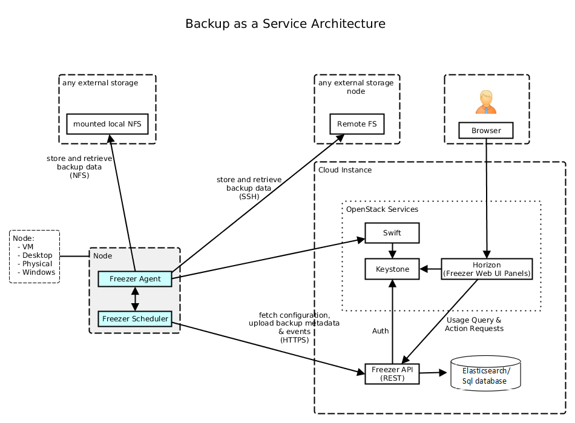
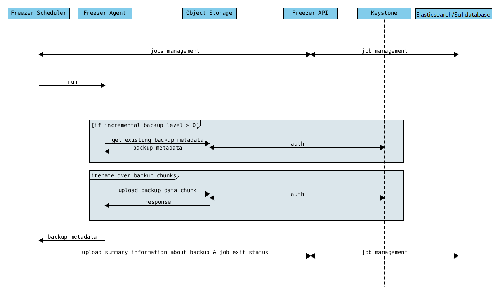
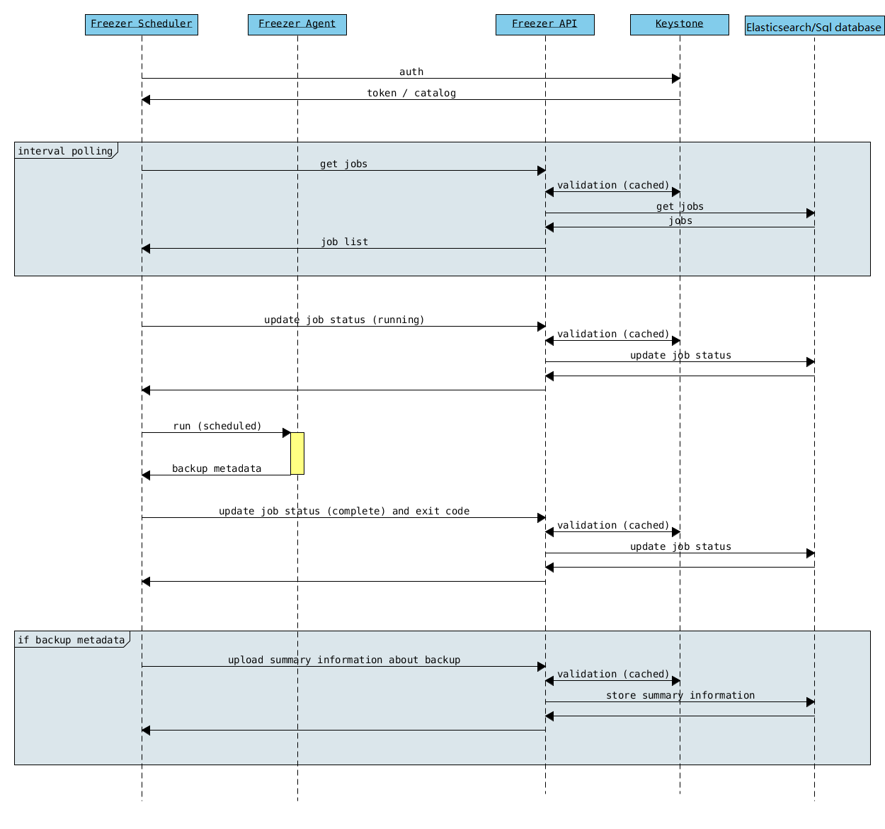
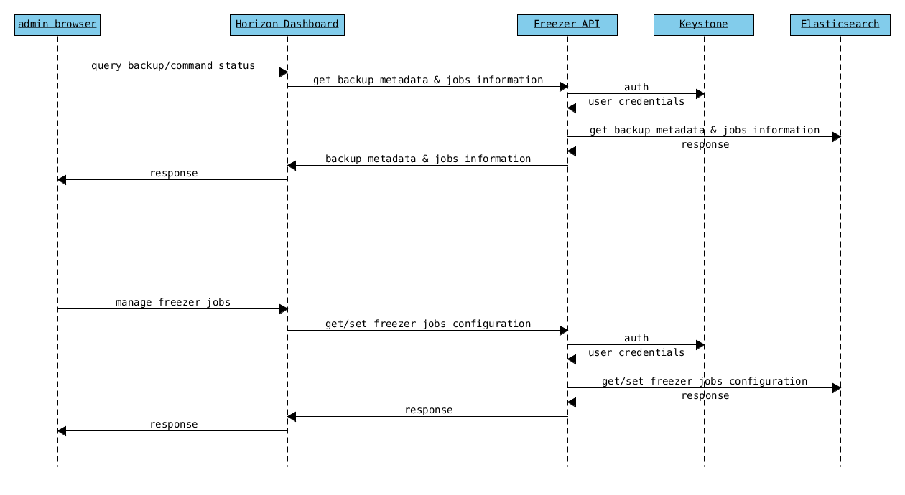
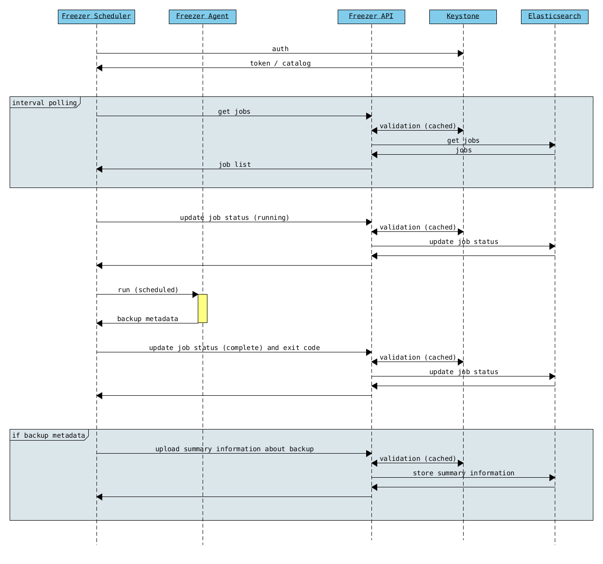

Welcome to Freezer's documentation!
===================================

Install Guides
--------------
.. toctree::
   :maxdepth: 2

   install/index

User Guides
-----------
.. toctree::
   :maxdepth: 2

   user/index
   cli/index

Admin Guides
------------
.. toctree::
   :maxdepth: 2

   admin/index

Dev Guides
----------
.. toctree::
   :maxdepth: 2

   contributor/index
   reference/index

About Freezer
=============

Key Features
------------
-  Backup your file system using point in time snapshot
-  Strong encryption supported: AES-256-CFB
-  Backup your file system tree directly (without volume snapshot)
-  Backup your journalled MongoDB directory tree using LVM snapshot to swift
-  Backup MySQL DB with LVM snapshot
-  Restore your data from a specific date automatically to your file system
-  Low storage consumption as the backup are uploaded as a stream
-  Flexible backup policy (incremental and differential)
-  Data is archived in GNU Tar format for file based incremental
-  Block based backup support (rsync)
-  Multiple compression algorithm support (zlib, bzip2, xz)
-  Remove old backup automatically according to the provided parameters
-  Multiple storage media support (Swift, local file system, ssh)
-  Flush kernel buffered memory to disk
-  Multi platform (Linux, Windows, \*BSD, OSX)
-  Manage multiple jobs (i.e. multiple backups on the same node)
-  Synchronize backups and restore on multiple nodes
-  Web user interface integrated with OpenStack Horizon
-  Can execute scripts/commands before or after a job execution

Freezer is combination for four different components:

Freezer Agent
-------------
Multiprocessing Python software that runs on the client side, where the data
backup is to be executed.

It can be executed standalone or by the Freezer Scheduler.

The Freezer Client provides a flexible way to execute backup, restore and other
actions on a running system.

In order to provide flexibility in terms of data integrity, speed, performance,
resources usage, etc. the freezer agent offers a wide range of options to
execute optimized backup according to the available resources as:

- Segments size (the amount of memory used)
- Queues size (optimize backups where I/O, bandwidth, memory or CPU is a constraint)
- I/O Affinity and process priority (it can be used with real time I/O and maximum user level process priority)
- Bandwidth limitation
- Client side Encryption (AES-256-CFB)
- Compression (multiple algorithms supported as zlib, bzip2, xz/lzma)
- Parallel upload to pluggable storage media (i.e., upload backup to swift and to a remote node by SSH,
  or upload to two or more independent swift instances with different credentials, etc.)
- Execute file based incremental (like tar), block based incremental (like rsync algorithm) and differential based backup and restore
- Multi platform as it can be run on Linux, Windows, \*BSD and OSX
- Automatic removal of old backups

Freezer Scheduler
-----------------
A client side component, running on the node where the data backup is to be
executed. It consists of a daemon that retrieves the data from the freezer API
and executes jobs (i.e. backups, restore, admin actions, info actions,pre
and/or post job scripts) by running the Freezer Agent.

The metrics and exit codes returned by the freezer agent are captured and
sent to the Freezer API.

The scheduler manages the execution and synchronization of multiple jobs
executed on a single or multiple nodes.

The status of the execution of all the nodes is saved through the API.

The Freezer scheduler takes care of uploading jobs to the API by reading job
files on the file system. It also has its own configuration file where job
session or other settings like the freezer API polling interval can be configured.

The Freezer scheduler manages jobs, for more information about jobs please
refer to: freezer_api/README.rst under JOB the sections.

Freezer API
-----------
The API is used to store and provide meta-data to the Freezer Web UI
and to the Freezer Scheduler. Also the API is used to store session
information for multi node backup synchronization. No workload data is stored in the API.

For more information to the API please refer to: freezer_api/README.rst

Freezer Web UI
--------------
Web interface that interacts with the Freezer API to configure and change
settings. It provides most of the features from the Freezer Agent CLI, advanced
scheduler settings such as multi-node backup synchronization, metrics,
and reporting.

DB Elasticsearch
----------------
Back-end used by the API to store and retrieve metrics, metadata sessions
information, job status, etc.

Low Resources Requirement
-------------------------
Freezer is designed to reduce to the minimum I/O, CPU and Memory Usage.
This is achieved by generating a data stream from tar (for archiving)
and gzip (for compressing). Freezer segments the stream in a configurable
chunk size (with the option --max-seg-size). The default segment size is
64MB, so it can be safely stored in memory, encrypted if the key is
provided, and uploaded to Swift as a segment.

Multiple segments are sequentially uploaded using the Swift Manifest.
All the segments are uploaded first, and then the Manifest file is
uploaded too, so the data segments cannot be accessed directly. This
ensures data consistency.

By keeping the segments small, in-memory, I/O usage is reduced. Also as
there's no need to store locally the final compressed archive
(tar-gziped), no additional or dedicated storage is required for the
backup execution. The only additional storage needed is the LVM snapshot
size (set by default at 5GB). The lvm snapshot size can be set with the
option --lvm-snapsize. It is important to not specify a too small snapshot
size, because in case a quantity of data is being written to the source
volume and consequently the lvm snapshot is filled up, then the data is
corrupted.

If more memory is available for the backup process, the maximum
segment size can be increased. This will speed up the process. Please
note that the segments must be smaller then 5GB, since that is the maximum
object size in the Swift server.

On the other hand, if a server has small memory availability, the
--max-seg-size option can be set to lower values. The unit of this
option is in bytes.

How the Incremental Works
-------------------------

The incremental backups is one of the most crucial features. The
following basic logic happens when Freezer executes:

1) Freezer starts the execution and checks if the provided backup name for
   the current node already exists in Swift.

2) If the backup exists, then the Manifest file is retrieved. This is
   important as the Manifest file contains the information of the
   previous Freezer execution.

Architecture
============

Freezer may seem complex at first look. But Following diagrams will give
you better understanding of the architecture:

Service Architecture
--------------------

Agent Backup Work Flow with API
-------------------------------

Agent Backup Without API
------------------------

.. image:: images/admin/freezer_agent_backup.png
   :width: 640 px

Freezer Scheduler with API
--------------------------

Freezer Job Session
-------------------

.. image:: images/admin/job_session.png
   :width: 640 px

Freezer Dashboard
-----------------

How to Scale
------------

