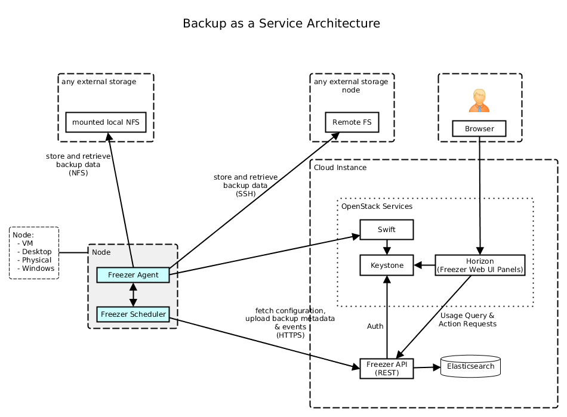
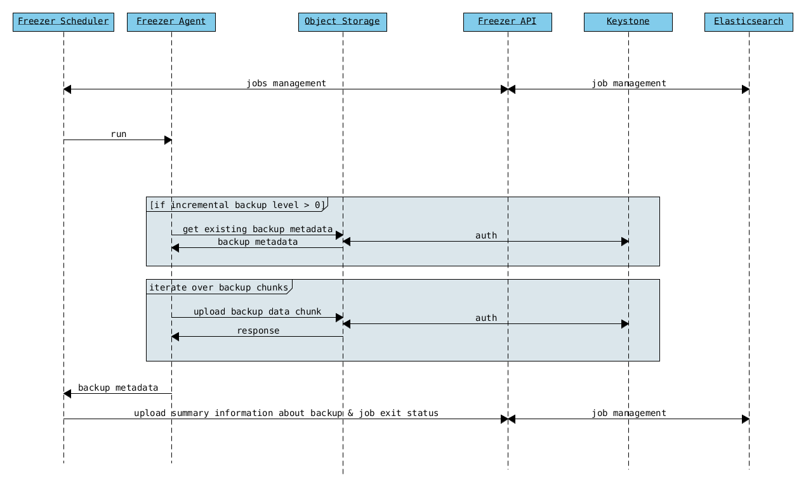
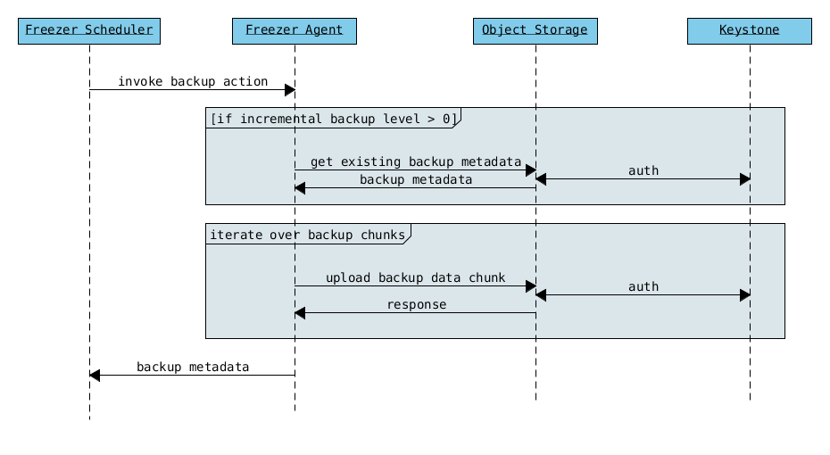
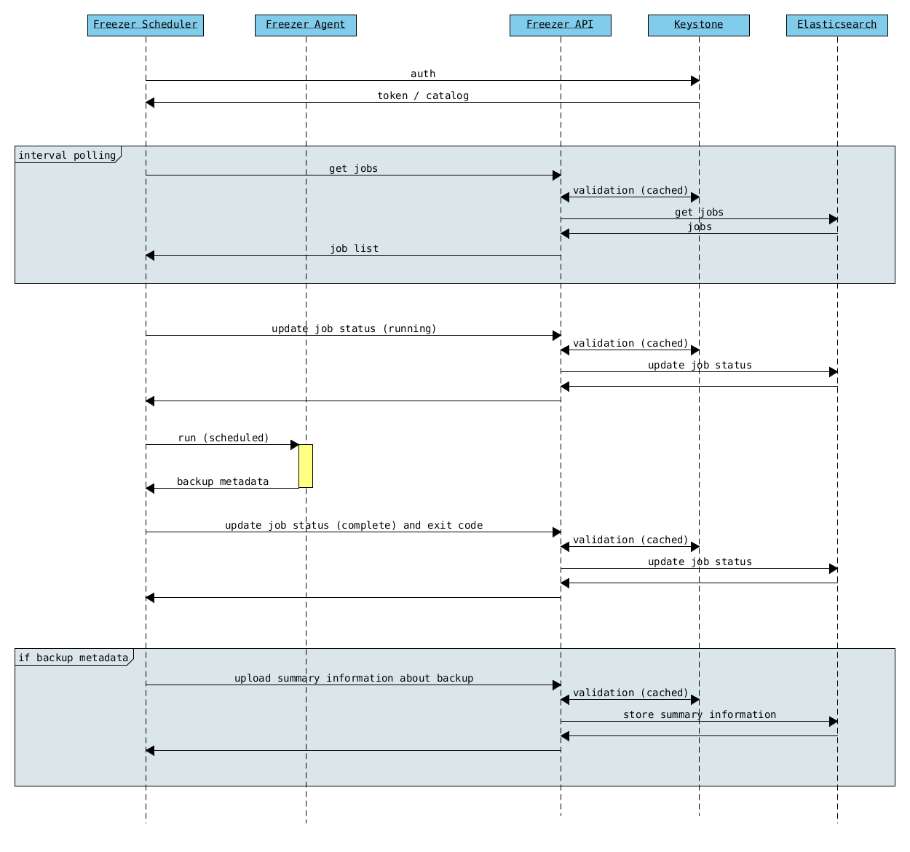
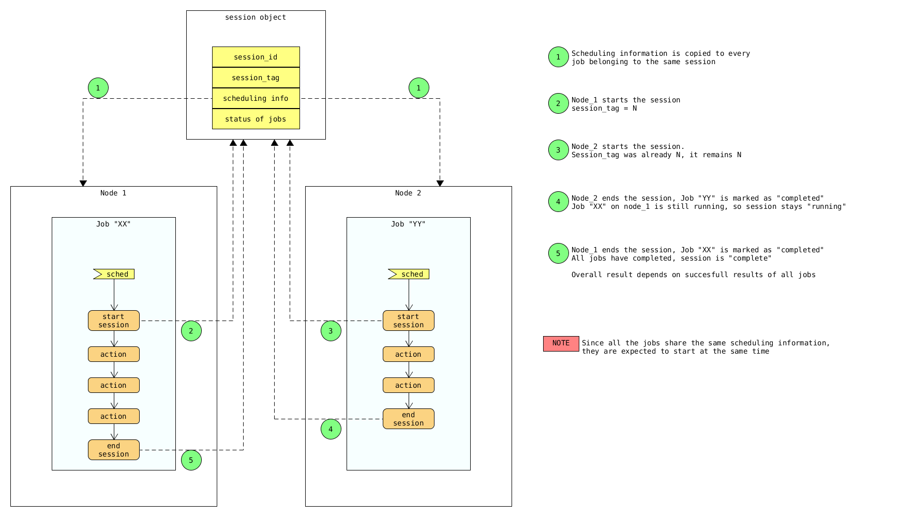
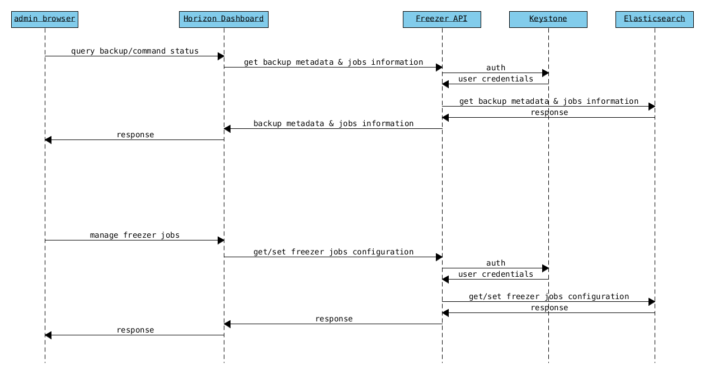

===============================
Freezer Overview & Architecture
===============================

Freezer is a distributed Backup and Restore as a Service platform designed
to deliver high-efficiency, flexible backup strategies across OpenStack
clouds and standalone heterogeneous environments.

Architecture & Core Components
==============================

Freezer features a modular architecture that cleanly separates control plane
orchestration, metadata storage, and stateless execution workers:

+-------------------+---------------------------------------------------------+
| Component         | Description                                             |
+===================+=========================================================+
| Freezer Web UI    | Web interface integrated with OpenStack Horizon that    |
|                   | interacts with the Freezer API to configure backup      |
|                   | policies, job schedules, multi-node synchronization,    |
|                   | metrics, and restore operations.                        |
+-------------------+---------------------------------------------------------+
| Freezer Scheduler | Orchestrator daemon. It owns all ``freezer-api``        |
|                   | communications (job schedules, status updates, Keystone |
|                   | Trust scoping, backup record lifecycle), manages job    |
|                   | execution, supports high availability via coordination  |
|                   | backends (tooz), and spawns Freezer Agent processes.    |
+-------------------+---------------------------------------------------------+
| Freezer Agent     | Multiprocessing worker software executing operations    |
|                   | directly against OpenStack services (Cinder, Glance,    |
|                   | Swift, Nova). It is stateless and does not depend on    |
|                   | or communicate with ``freezer-api``.                    |
+-------------------+---------------------------------------------------------+
| Freezer API       | RESTful control plane API providing centralized storage |
|                   | and querying of backup metadata, job definitions,       |
|                   | client registrations, and session coordination state.   |
+-------------------+---------------------------------------------------------+
| Database (DB)     | Backend datastore (Elasticsearch or SQLAlchemy          |
|                   | compatible SQL DBs) used by Freezer API to maintain     |
|                   | metrics, metadata sessions, and jobs.                   |
+-------------------+---------------------------------------------------------+

3-Tier Control & Execution Flow
-------------------------------

Freezer is designed as a 3-tier architecture with a strict separation of
concerns between the API control plane, the scheduler orchestrator, and
stateless worker execution agents:

::

  ┌─────────────────┐ 1. POST /v2/backups (status: creating) ┌────────────────┐
  │                 │ ─────────────────────────────────────> │                │
  │                 │ <───────────────────────────────────── │                │
  │                 │          2. returns backup_id          │  freezer-api   │
  │freezer-scheduler│                                        │  (Central DB   │
  │ (Orchestrator)  │  4. PATCH /v2/backups/{id} (available) │    Control)    │
  │                 │ ─────────────────────────────────────> │                │
  └───────┬─────────┘                                        └────────────────┘
          │
          │ 3. Spawns subprocess:
          │    freezer-agent --config <tmp_file>
          │    (with backup_id in INI)
          ▼
  ┌────────────────┐        5. Creates Backup               ┌────────────────┐
  │ freezer-agent  │ ─────────────────────────────────────> │ OpenStack Svcs │
  │(Stateless Wkr) │      metadata={'created_by':'freezer', │(Cinder/Swift/  │
  └────────────────┘                'freezer_backup_id': id}│  Glance/Nova)  │
                                                            └────────────────┘

You can check more detailed diagrams of interactions below.

Resource Efficiency & Performance Tuning
=========================================

Freezer is engineered to minimize CPU, RAM, and I/O consumption on host
systems:

Stream Processing & Segmentation
--------------------------------
- Workload archives generated via GNU Tar or rsync are processed as a
  continuous stream (compressed via zlib, bzip2, or xz and encrypted via
  AES-256-CFB).
- Streams are partitioned into configurable chunk sizes (set via
  ``--max-seg-size``, default 64MB) directly in memory without requiring
  intermediate local disk space.
- Segments are uploaded sequentially to Swift or remote storage, followed by
  a final Manifest object. The manifest links all segments together while
  ensuring data consistency during uploads.

Memory & Storage Optimization
-----------------------------
- **Small-Memory Hosts**: On memory-constrained systems, ``--max-seg-size``
  can be lowered to reduce peak memory usage.
- **High-Throughput Nodes**: On hosts with abundant memory, segment sizes
  can be increased (up to the 5GB Swift single-object limit) to maximize
  network and upload throughput.
- **LVM Snapshot Storage**: When performing LVM-backed consistent snapshots
  (e.g. for MongoDB, MySQL, or filesystem trees), additional temporary disk
  space equal to the configured snapshot size (``--lvm-snapsize``, default
  5GB) is allocated in the LVM volume group. Ensure snapshot sizes account
  for write volume during backup execution to prevent snapshot exhaustion.

How Incremental Backups Work
============================

Freezer supports efficient file-level incremental backups (GNU Tar) as well
as block-level differentials (rsync engine).

Workflow
--------

1. **Initialization & Manifest Lookup**:
   When a backup job starts, the Freezer Agent checks the destination storage
   (Swift/SSH/Local) for existing backup manifests corresponding to the
   target backup set and hostname.

2. **Metadata Inspection**:
   If prior backups exist, Freezer retrieves the most recent Manifest metadata
   file. The manifest contains full index headers, timestamp markers, and
   segment lists from preceding backup runs.

3. **Delta Calculation**:

   - For file-based backups, GNU Tar uses stored timestamp/mtime metadata to
     identify modified, added, or deleted files since the previous
     level/incremental baseline.
   - For block-level backups, rsync block checksum matching is used to
     transmit only modified byte blocks.

4. **Segmented Upload & Manifest Commit**:

   - Newly generated delta streams are encrypted, compressed, split into
     memory chunks, and uploaded.
   - Once all segment uploads complete successfully, a new Manifest object is
     uploaded, creating an immutable point-in-time recovery point without
     altering prior backup iterations.

System Visual Diagrams
======================

Service Architecture
--------------------

Agent Backup Workflow (with API)
--------------------------------

Agent Standalone Backup (without API)
-------------------------------------

Freezer Scheduler & API Flow
----------------------------

Job Sessions & Multi-Node Synchronization
-----------------------------------------

Horizon Dashboard Overview
--------------------------

High Availability & Scalability
-------------------------------
.. image:: images/admin/freezer_scheduler_api_scale.png
   :width: 640 px
   :alt: Freezer Scaling Architecture
